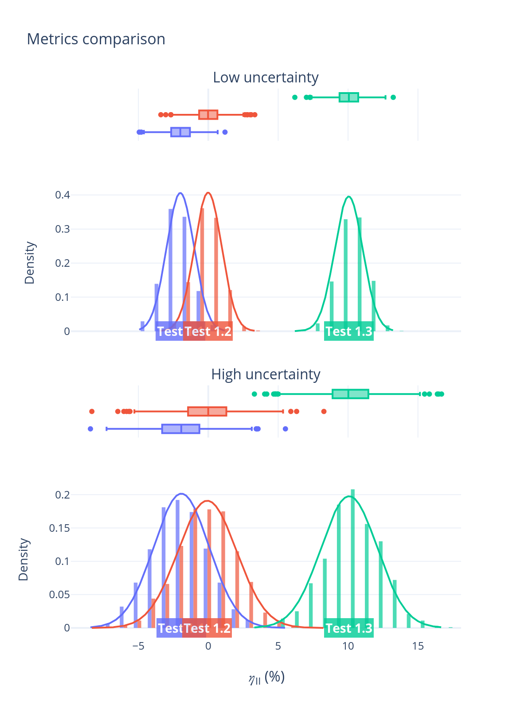
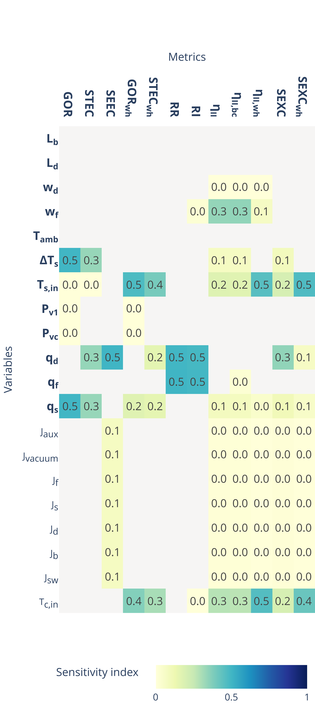
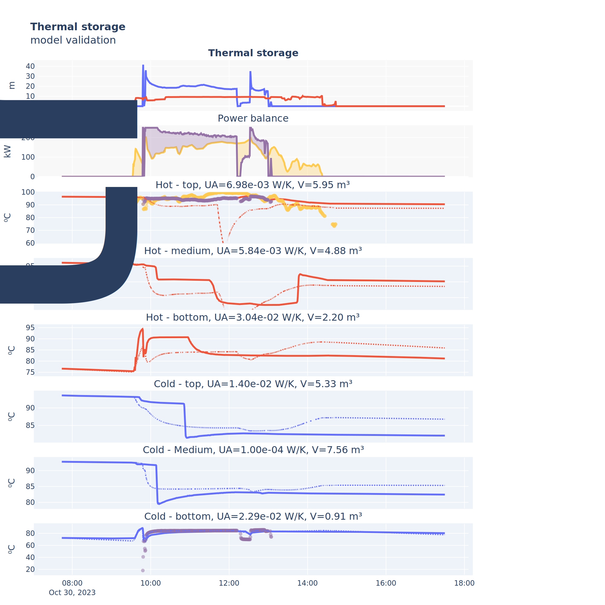
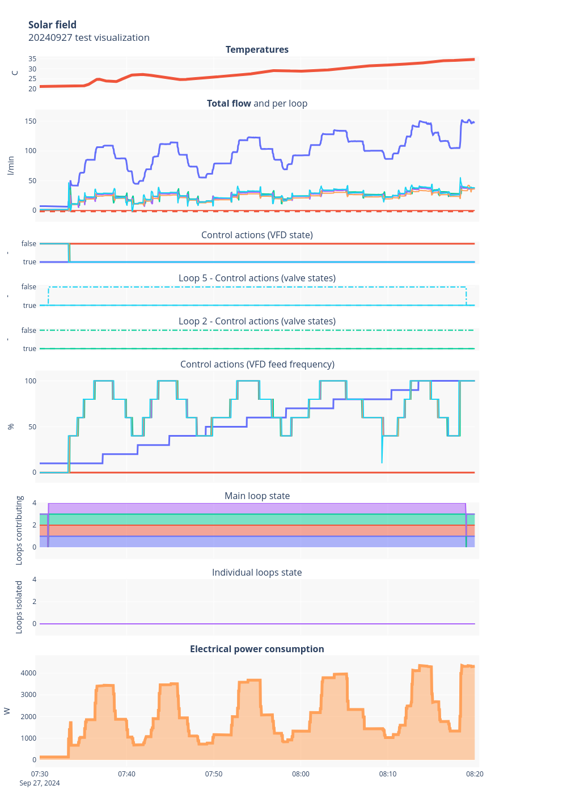
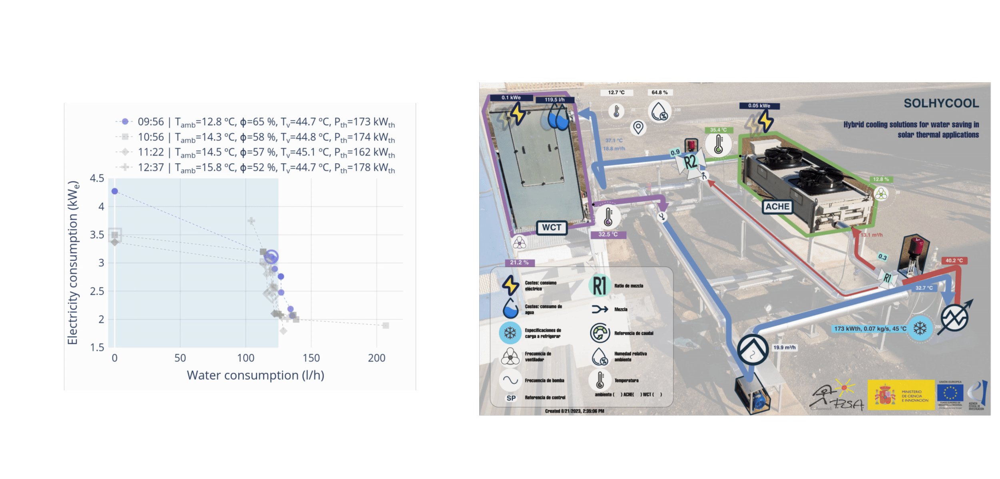
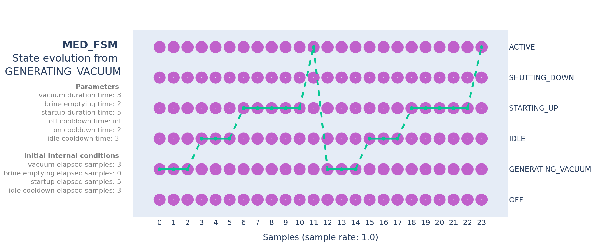
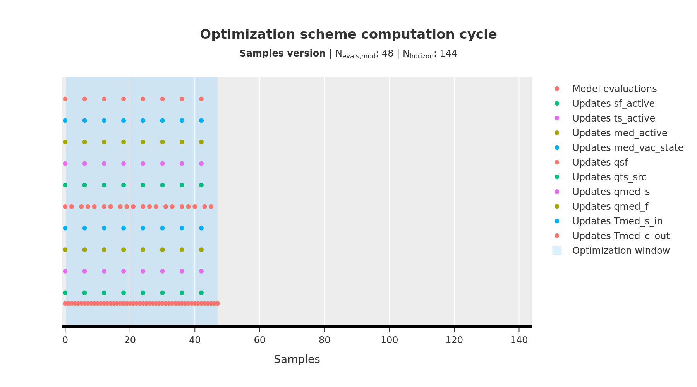

TODO:
Ideally, all of the examples showcased here should be generated from the `examples` script.

## Examples

### Metrics comparison

Comparison of signals with uncertainty for some performance metric.

[Interactive version](assets/metrics_comparison.html)

### Sensitivity analysis

[Interactive version](assets/sensitivity_analysis.html)

### Experimental results plot

Timeseries signals

#### Thermal storage

[Interactive version](assets/thermal_storage_validation_20231030_generated_202403071421.html)

#### Solar field

### System state evolution

[Interactive version](assets/SolarMED_state_evolution_20230703.html)

### Multi-objective optimization results with facility diagram

### Finite state machines

Finite state machine evolution 

[Interactive version](assets/MED_FSM_test_state_evolution.html)

### Optimization cycle animation

# TODO
- [ ] Add path explorer gif
- [ ] Add point selection gif
- [ ] Add benchmarks, both static and interactive
- [x] Add configuration files to generate the experimental plots
